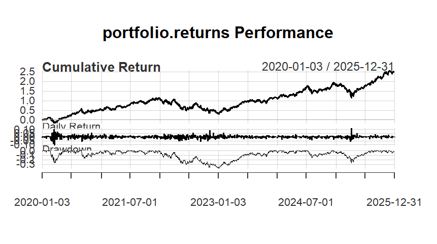
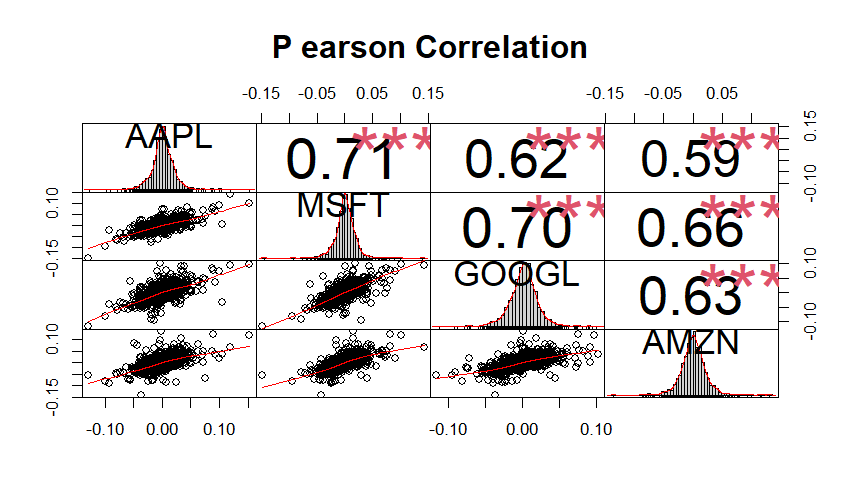
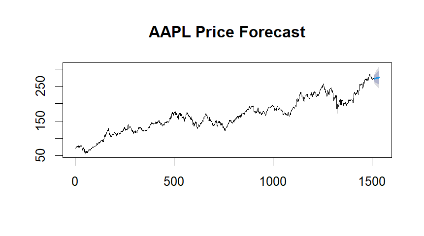

# Multi-Asset-Portfolio-Risk-Forecasting
This project analyzes the returns, correlations, and risk metrics of major technology stocks — Apple (AAPL), Microsoft (MSFT), Google (GOOGL), and Amazon (AMZN)

goals:
Evaluate the performance and risk of a diversified tech portfolio.
Measure correlations between major stocks.
Estimate Value at Risk  and Expected Shortfall .
Forecast AAPL’s price trend using ARIMA modeling.

Risk Metrics:
Mean Return and Standard Deviation
Sharpe Ratio for risk-adjusted performance
Value at Risk (VaR) and Expected Shortfall (ES) at 95% confidence

VaR (95%);	-0.0272
ES (95%): -0.0394

Computes pairwise Pearson correlations between stock returns:
Pair	Correlation
AAPL–MSFT	0.71
AAPL–GOOGL	0.62
AAPL–AMZN	0.59
MSFT–GOOGL	0.70
MSFT–AMZN	0.66
GOOGL–AMZN	0.63
The correlation matrix and scatter plots visualize strong co-movement among tech stocks, confirming sector interdependence.

AAPL Price Forecast:  
Shows historical trend and projected future prices with confidence intervals.

</>Markdown

